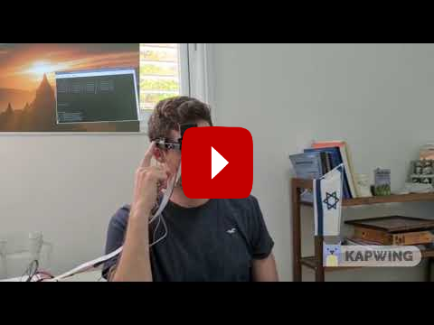
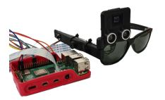
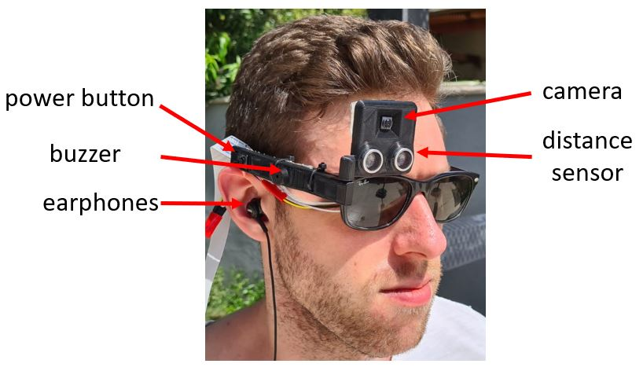
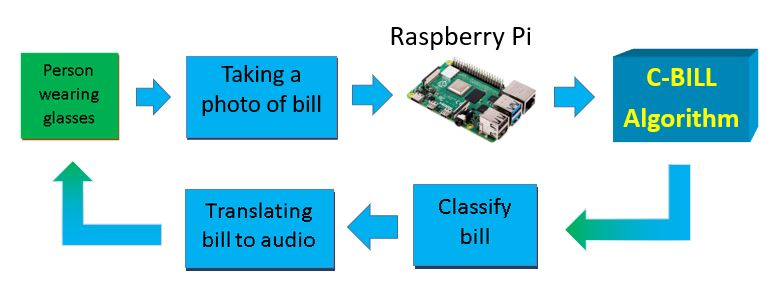
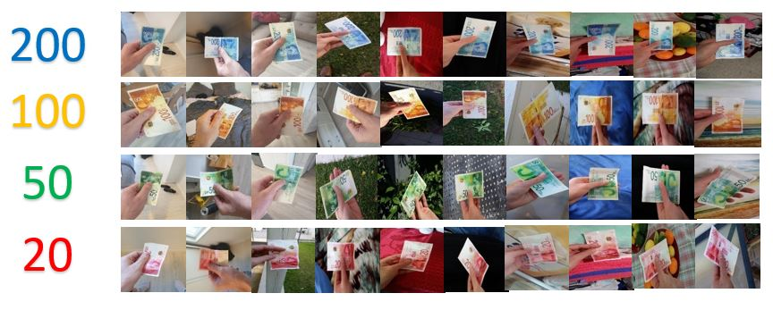
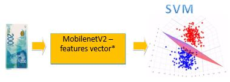
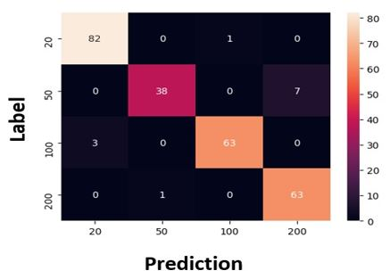

# Money-Bill-Classification
Final Project - Electrical Engineering - Tel Aviv University

  
  <h1>
    Introduction
  </h1>
 
  
  

		In our final project we focused on the fields of image processing, machine learning and deep learning. 
    We tried to help other with the knowledge we acquired during our studies. 
    C-BILL is a wearable device that enables visually impaired to be aware of the type of bill he/she is holding.
  

  
  

    <h1>
      Implementation
    </h1>
  <h3>
    C-BILL block diagram: 
  </h3>
      
  

  

  <h1>
    Data
  </h1>
  

    The dataset was created thanks to mass recruitment and augmentation. 
    Train: ~1200 images. 
    Test : 258 images (different people from train)
  

  

  <h1>
    Results
  </h1>
  <h3>
    Transfer learning based on pre-trained deep feature extractor + SVM:
  </h3>
  
  <pre>
  *Features vector is the network last output before the first Fully Connected layer.
  Those features contain all the information learned by the neural network with respect to the input image.
</pre>
 
  <h3>
    Final Results:
  </h3>
  
  
  <table style="width:30%">
  <tr>
    <th>Test Set</th>
    <th >Real Time</th>
  </tr>
  <tr>
    <td>95.34%</td>
    <td>90%</td>
   
  </tr>
</table>

